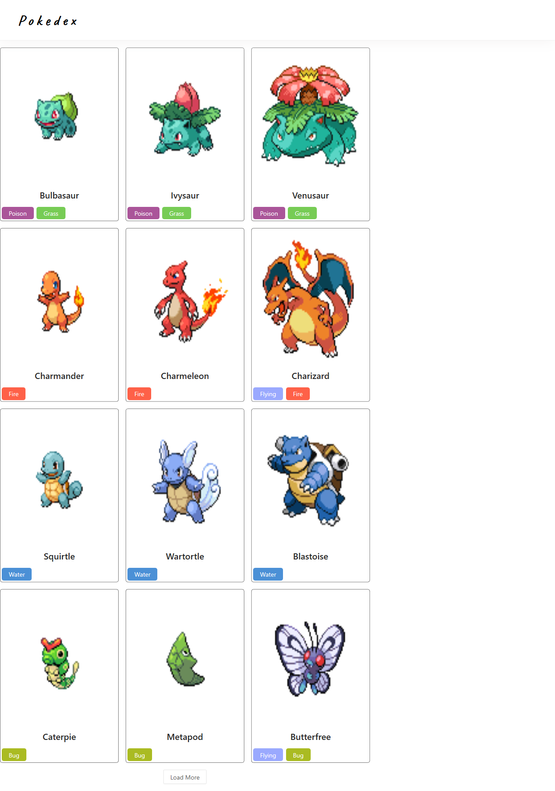
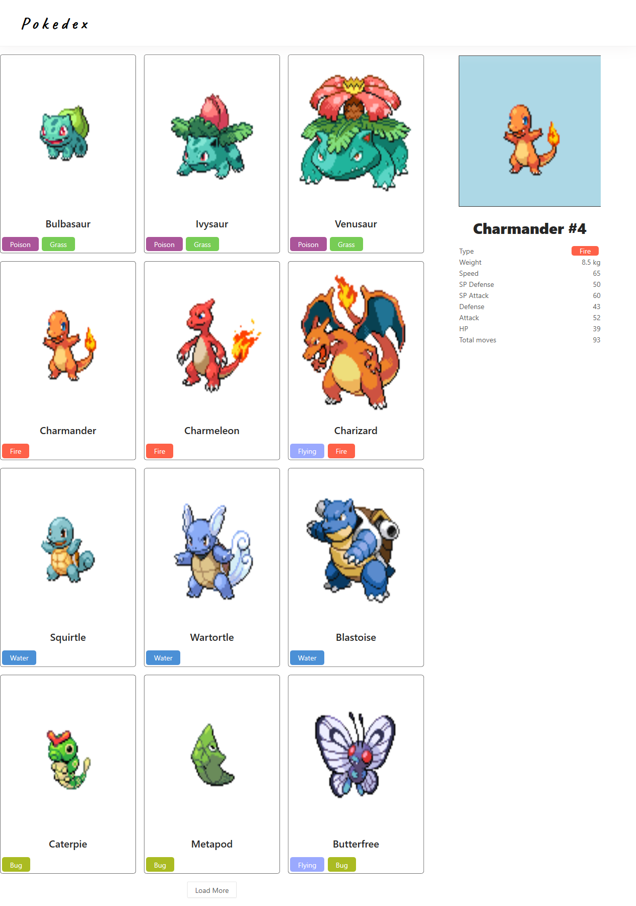

## React-pokedex-app

React-pokedex-app is a simple pokemon information engine made with ReactJS and powered by [PokéAPI](https://pokeapi.co/).

#### Demo

---

1. HomePage

   

2) Selected Pokemon and main information about it

#### Installation

---

1. Clone the repo: `git clone https://github.com/valerasamoylov/react-pokedex-app.git`
2. Select a directory: `cd react-pokedex-app`
3. Install packages: `npm install`
4. Lauch project: `npm start`
